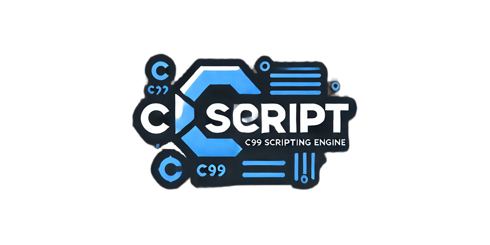

  
[](https://discord.gg/tPWjMwK)
[](https://bsky.app/profile/tinyBigGAMES.bsky.social)

# 🅲🆂cript

**🅲🆂cript** represents a sophisticated 🅲99 scripting engine meticulously crafted for experienced 🧑‍💻 Delphi developers. Leveraging the compact yet highly versatile **TinyCC** compiler, **🅲🆂cript** seamlessly integrates ⚙️ dynamic backend code generation into the Delphi development environment. With **🅲🆂cript**, Delphi developers can 🛠️ compile and execute 🅲 scripts at runtime, directly in 💾 memory, and generate output in the form of 🪟 Win64 executables (.exe), dynamic-link libraries (.dll), or 📂 object files (.obj).

### ✨ Features

- **⚙️ Dynamic Code Generation**: Facilitates runtime 🛠️ compilation and execution of 🅲99 code directly within the Delphi application context.
- **🖥️ Versatile Output Options**: Supports in-memory execution alongside output to executable, DLL, or object file formats.
- **📦 Effortless Integration with 🅲 Libraries**: Capable of loading and interacting with compiled modules, including `.dll`, `.a`, and `.lib` files.
- **📂 Embedded Resources**: TinyCC runtime components (.h, .a, .o files) are encapsulated within a compressed zip resource and linked directly into your Delphi executable, thus minimizing 🗂️ file system dependencies while ensuring runtime availability.
- **⚠️ Customizable Error Handling**: Offers the ability to assign custom error handlers, streamlining 🐞 debugging and enabling robust error management.
- **🔍 Full Symbol Access**: Provides direct access to symbols generated by the compiled code and to symbols within dynamically loaded modules, simplifying the integration of complex functionalities.

### 🛠️ How It Works

**🅲🆂cript** employs **TinyCC**, which is statically linked into the Delphi runtime, to compile and execute 🅲 code dynamically. All critical 🅲 runtime I/O operations—such as `open`, `close`, `read`, and `lseek`—are re-routed to Delphi-native implementations. Typically, TinyCC would require runtime files to be available separately; however, in **🅲🆂cript**, these files are stored within the Delphi executable itself as compressed resources, resulting in a 📦 self-contained virtualized I/O model. When **TinyCC** requests access to runtime files, a custom Delphi I/O handler checks the embedded zip archive, thereby ensuring a seamless, efficient, and isolated execution environment.

### 🧩 Integration with Delphi

**🅲🆂cript** functions as a conduit to harness the capabilities of 🅲99 code within the Delphi development framework. Whether it involves optimizing particular operations for ⚡ enhanced performance, interfacing with pre-existing 🅲 libraries, or augmenting Delphi's feature set with the expressive capabilities of 🅲, **🅲🆂cript** provides a cohesive and sophisticated development toolset.

### 🗝️ Key Classes and Types

**TCScript** is the primary interface for engaging with **🅲🆂cript** functionalities. Below is an overview of its core components:

#### 🅃CScriptOutputType
- `csMEMORY`: 🛠️ Compile and execute scripts entirely in memory.
- `csLib`: Generate 📂 object files (`.obj`).
- `csEXE`: Generate a 🪟 Win64 executable.
- `csDLL`: Generate a 📄 dynamic-link library.

#### 🅃CScriptExeSubsystem
- `csCONSOLE`: Targets 🎮 console application subsystems.
- `csGUI`: Targets 🎨 graphical user interface subsystems.

#### 🅃CScript Class Overview
- **🏗️ Construction and Destruction**
  - `constructor Create()`: 🛠️ Initializes an instance of **TCScript**.
  - `destructor Destroy()`: 💣 Releases resources tied to the **TCScript** instance.
- **⚠️ Error Handling**
  - `procedure SetErrorHandler(const ASender: Pointer; const AHandler: TCScriptErrorEvent)`: Assigns a custom error handler for error management.
  - `procedure GetErrorHandler(var ASender: Pointer; var AHandler: TCScriptErrorEvent)`: Retrieves the currently assigned error handler.
- **📂 Path Management**
  - `function AddLibraryPath(const APath: string): Boolean`: Registers a 📁 library path for the compiler.
  - `function AddIncludePath(const APath: string): Boolean`: Registers an include path for locating header files.
- **🛠️ Compilation and Execution**
  - `function SetOutputType(const AOutputType: TCScriptOutputType): Boolean`: Specifies the desired output type for script compilation.
  - `function CompileString(const ABuffer: string): Boolean`: Compiles a provided string of 🅲 code.
  - `function AddFile(const AFilename: string): Boolean`: Adds a 📄 source file to the compilation unit.
  - `function Run(): Boolean`: Executes the compiled script.
- **📦 Library Management**
  - `function AddLibrary(const AName: string): Boolean`: Adds an external library to be dynamically linked during execution.
- **🔍 Symbol Management**
  - `procedure AddSymbol(const AName: string; AValue: Pointer)`: Registers a symbol to the scripting context.
  - `function GetSymbol(const AName: string): Pointer`: Retrieves the address of a registered symbol.
- **🛠️ Utility Functions**
  - `procedure Reset()`: Resets the **TCScript** instance, clearing previous states.
  - `function SaveOutputFile(const AFilename: string): Boolean`: Saves the compiled output to a specified 📄 file.

### 📖 Example Usage

The following example illustrates how to instantiate **TCScript**, add a file for compilation, and execute the resulting script:

```delphi
procedure CScriptErrorEvent(const ASender: Pointer; const AText: string);
begin
  WriteLn(AText);
end;

procedure AddFileRun();
var
  LCScript: TCScript;
begin
  LCScript := TCScript.Create();
  try
    // Set the ⚠️ error handler
    LCScript.SetErrorHandler(nil, CScriptErrorEvent);
    
    // Configure the output type for in-memory execution
    LCScript.SetOutputType(csMEMORY);
    
    // Add include and library paths
    LCScript.AddIncludePath('res/include');
    LCScript.AddLibraryPath('res/lib');
    
    // Add the 🅲 source file to the scripting engine
    LCScript.AddFile('res/src/test01.c');
    
    // Execute the compiled script
    if not LCScript.Run() then
      WriteLn('❌ Failed to execute script.');
  finally
    // Release resources
    LCScript.Free();
  end;
end;
```

### Prerequisites
- **Delphi 12 CE or higher** 🖥️
- **Windows 10 or higher** 🪟
- **Tested on Windows 11 64-bit (23H2), Delphi 12.2** ✅

### 🛠️ Installation

To integrate **🅲🆂cript** into your Delphi project:

1. **⬇️ Download the latest version** from the **🅲🆂cript** repository.
2. **📦 Unzip** to your desired location.
3. **➕ Add the `src` folder** to the Delphi search path.
4. **➕ Add `🅲🆂cript` to your project's uses section**.
5. **📖 See the examples** for more information on usage.

### 🤝 Contributions

Contributions to **🅲🆂cript** are highly encouraged. Please feel free to submit issues, suggest new features, or create pull requests to expand the capabilities and robustness of the scripting engine.

### 📝 License

**🅲🆂cript** is distributed under the 🆓 BSD-3-Clause license. For more details, refer to the `LICENSE` file.

### Support

- <a href="https://github.com/tinyBigGAMES/CScript/issues" target="_blank">Issues</a>
- <a href="https://github.com/tinyBigGAMES/CScript/discussions" target="_blank">Discussions</a>
- <a href="https://github.com/tinyBigGAMES/CScript/wiki" target="_blank">Wiki</a>
- <a href="https://learndelphi.org/" target="_blank">Learn Delphi</a>

---

Whether you seek to ⚡ enhance computational performance, interface seamlessly with existing 🅲 libraries, or expand the features of your Delphi applications, **🅲🆂cript** provides a powerful, integrated solution for combining the strengths of Delphi and 🅲99 programming.

🔓 Unlock new possibilities with **🅲🆂cript** and elevate your Delphi development experience through hybrid programming techniques.


<p align="center">

</p>
<h5 align="center">

Made with :heart: in Delphi
</h5>

